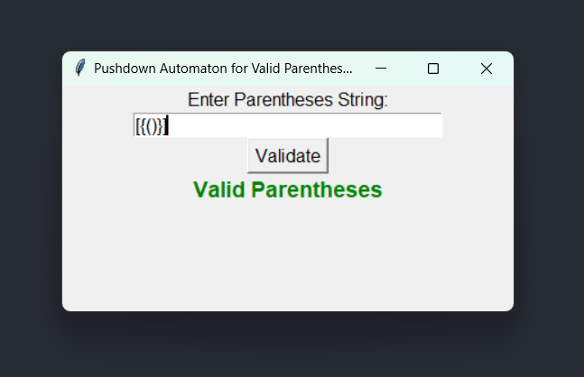
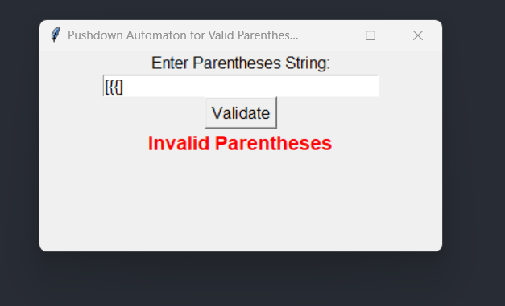

# Valid-Parenthesis-GUI
GUI based application on pushdown automata for accepting valid parenthesis built with tkinter python.

[](https://www.python.org/)  [](https://docs.python.org/3/library/tkinter.html) 

[](https://github.com/v3rma9579)


### Setup

  ##### Clone the repository
```bash
git clone https://github.com/v3rma9579/Valid-Parenthesis-GUI
```
  ##### Move to the desired folder
```bash
cd \Valid-Parenthesis-GUI
```

  ##### Install python 
```bash
https://www.python.org/downloads/
```

  ##### Install tkinter
```bash
pip install tk
```

  ##### Install turtle 
```bash
pip install turtle
```


### Screenshots





